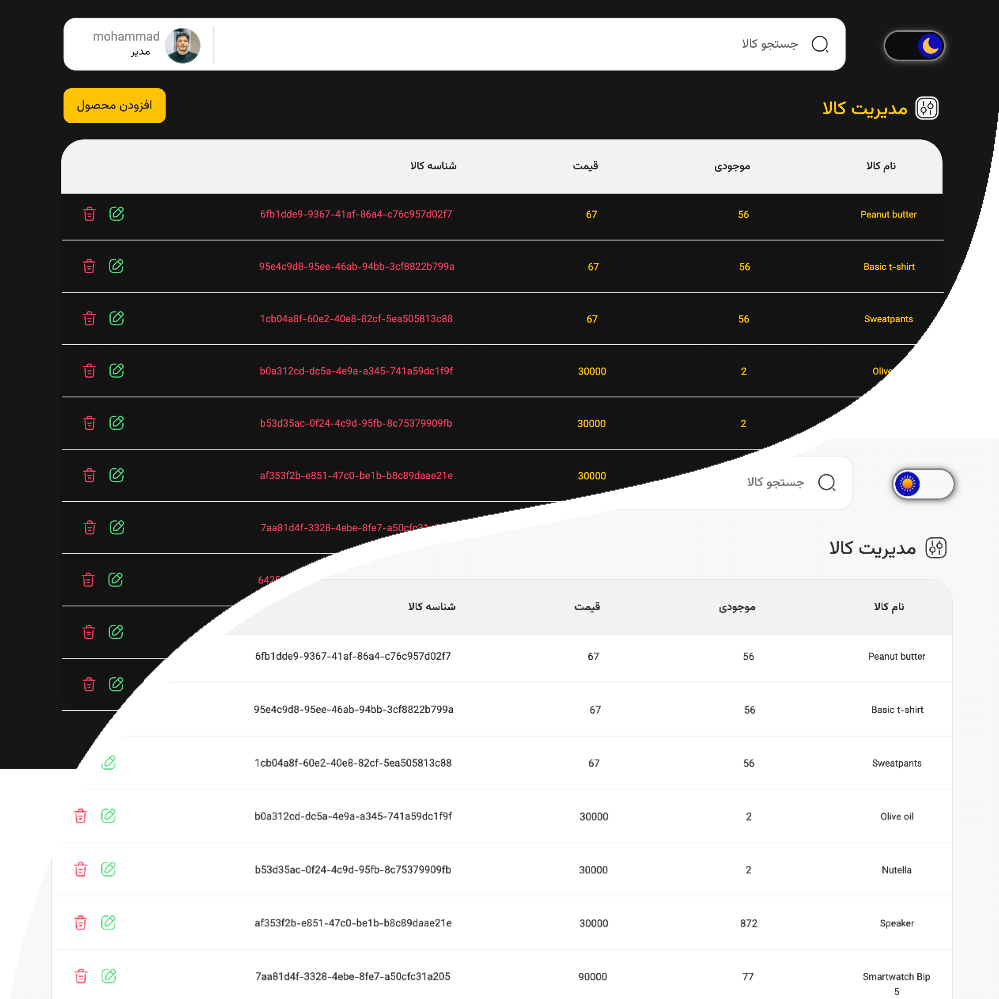

# ⚛️ Warehouse App

A scalable React + Vite Warehouse App following **feature-based architecture**.

This project offers a clean, modular structure, enabling you to save and manage your contacts effortlessly with  
a beautiful and intuitive UI.
It also includes secure authentication and role-based authorization for users

 

 

---

## 🚀 Features

- 🔑 Authentication & Authorization (JWT-based)
- 🔍 Debounced search by name
- 📄 Paginated product list
- ⏳ Loading bar for user actions
- 🌙 Light & Dark mode
- ✅ Reusable & scalable file structure

---

## 🧑🏻‍🔧 Tech Stack

- React 19
- Vite
- React Query (TanStack Query)
- React Paginate
- React Hook Form + Yup
- CSS Modules
- Feature-based architecture

---

## 📬 Contact

Made with lots of ☕️️ by **[Mohammad Fartoot]**  
GitHub: [@MohammadFartoot](https://github.com/MohammadFartoot)
